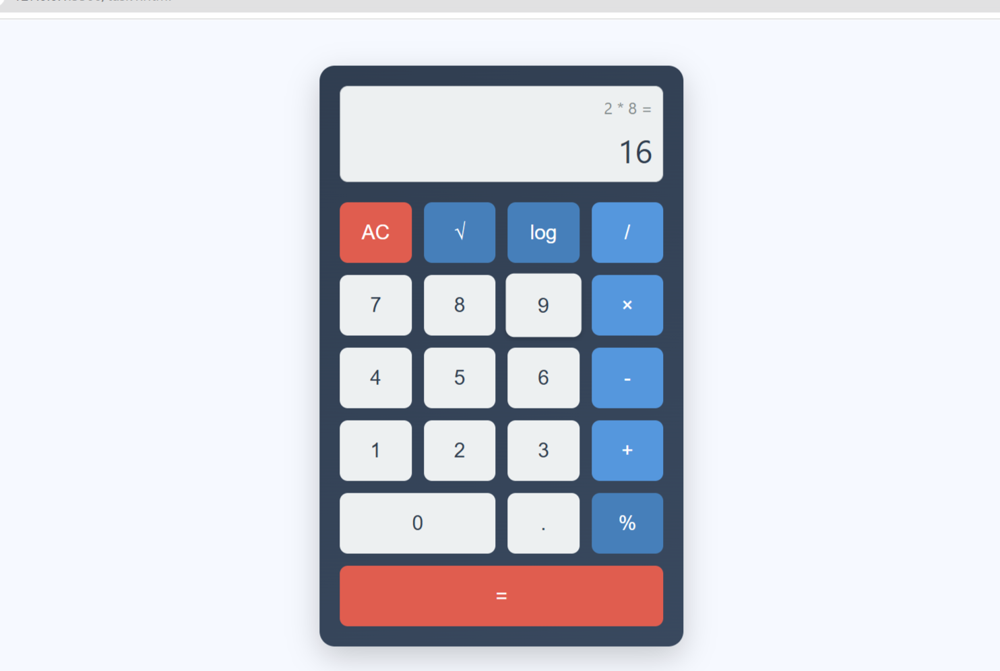

# OIBSIP_Level2_Task1
# 🔢 Advanced Calculator

A sleek, responsive, and fully functional web-based calculator built using HTML, CSS, and JavaScript. This calculator supports basic arithmetic operations along with scientific functions like square root, logarithm, and percentage.

---

## 🚀 Features

- ✅ Basic arithmetic: `+`, `-`, `×`, `÷`
- 🧠 Scientific functions: square Root (`√`), logarithm (`log`), percentage (`%`)
- 📱 Responsive design
- 🎨 Stylish UI with gradients, shadows, and animations
- 📌 Operation history display for clarity

---

### 🔷 CSS Highlights (`task1.css`)
- Uses **Flexbox and CSS Grid** for structured, responsive layouts.
- Includes **smooth hover effects and gradient backgrounds** to enhance the UI experience.

### 🟨 JavaScript Highlights (`task1.js`)
- Implements **modular logic using ES6 arrow functions** for operations and utility.
- Uses **built-in `Math` methods** (`sqrt`, `log10`, `%`) and dynamic DOM manipulation to update the display and operation history in real-time.

## 🖼️ Preview

> 
